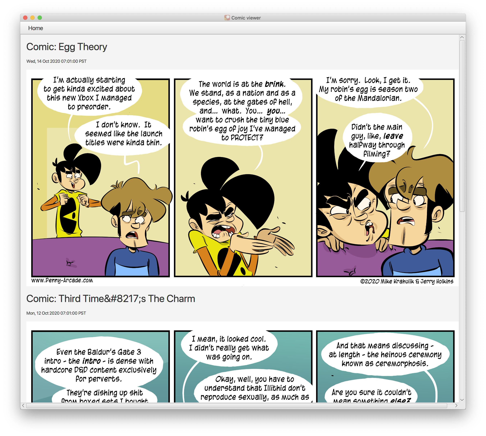
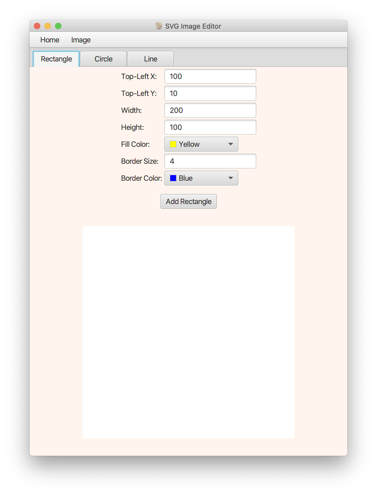
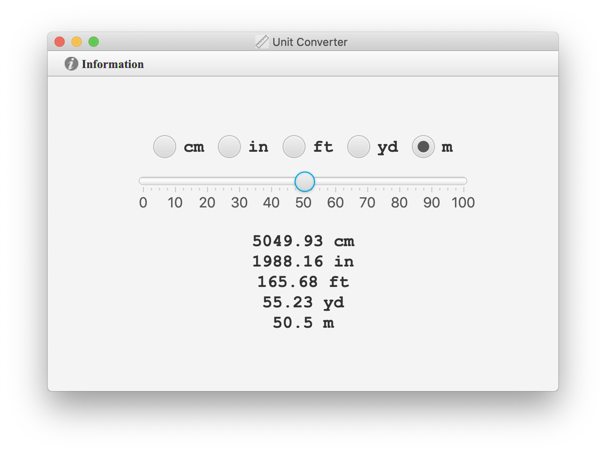

# My Java Tools

> A collection of Java based tools with JavaFX frontend.

These tools were built between 2016-2017 in the purpose of studying JavaFX. There were 30+ tools built and most of them are just very simple and not useful projects, therefore I decided just uploaded these few tools which I believe are useful.

### 01 RSS Reader

It's a clean RSS reader which can retrieve given RSS feed. To use it, you just need to modify the RSS link in the code and it will update the content every time you run the applicaiton.

I personally used it as a comic viewer which retrieves comics from [Penny-Arcade][https://www.penny-arcade.com/]. Not a fan of it, but sometimes it's funny. :smile:

### 02 SVG Image Creator

Scalable Vector Graphics (SVG) offers better details of images, but somehow not very popular. This tool provides the fundamental needs to create a SVG image and save it to your computer.

I used XOM model since SVG is based on XML.

### 03 Unit Convertor

A sleek unit convertor with a slider.

It converts units between cm, inch, feet, yard, and meter. Users can switch between different units to set which one converts to other units. 

~~~~
Although it gives percise results, a slider in a unit convertor?!
~~~~

